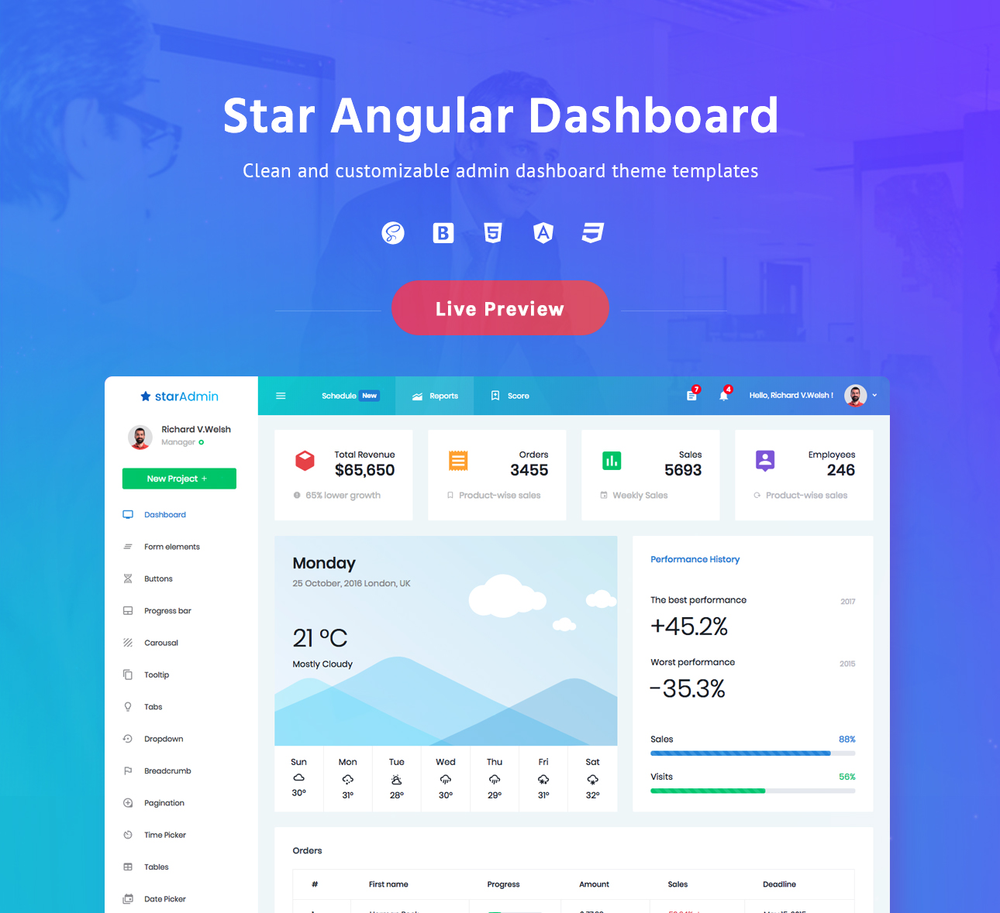

# Angular 5 CRUD Using Firebase
An Angular 6 Sample Project to Implement CRUD Operations - Insert Update and Delete Using Firebase Project.

###### Before Running this Project
 1. Install npm packages using 'npm install' command.
 2. Configure firebase project with your gmail account. 

## Demo

Visit: https://www.bootstrapdash.com/demo/star-admin-angular/

[](http://www.bootstrapdash.com/demo/star-admin-angular)

## Installation

### What's included

Within the download you'll find the following directories and files, logically grouping common assets and providing both compiled and minified variations. You'll see something like this:

### Usage

``` bash
# clone the repo
$ git clone https://github.com/Istiaq-Hossain-Shawon/angular-7-crud-with-firebase.git

# go into app's directory
$ cd angular-7-crud-with-firebase

# install dependencies
npm install

# serve with hot reload at localhost:4200
ng serve

# build for production with minification
ng build
```
# Port number 4200 is already in use. Type below command in cmd:
Step 1: Find the connection’s PID
> netstat -ano | findstr :yourPortNumber
Then locate the PID (something like 10764)
Step 2: Kill the process using it’s PID
> tskill yourPID
Step 3: Restart your server